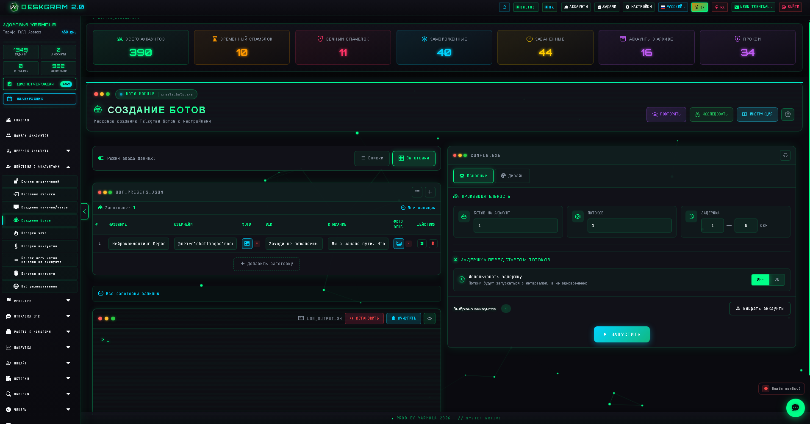
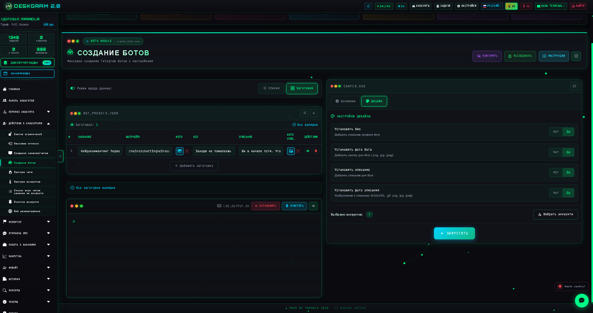
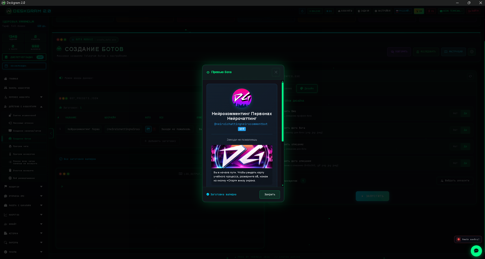
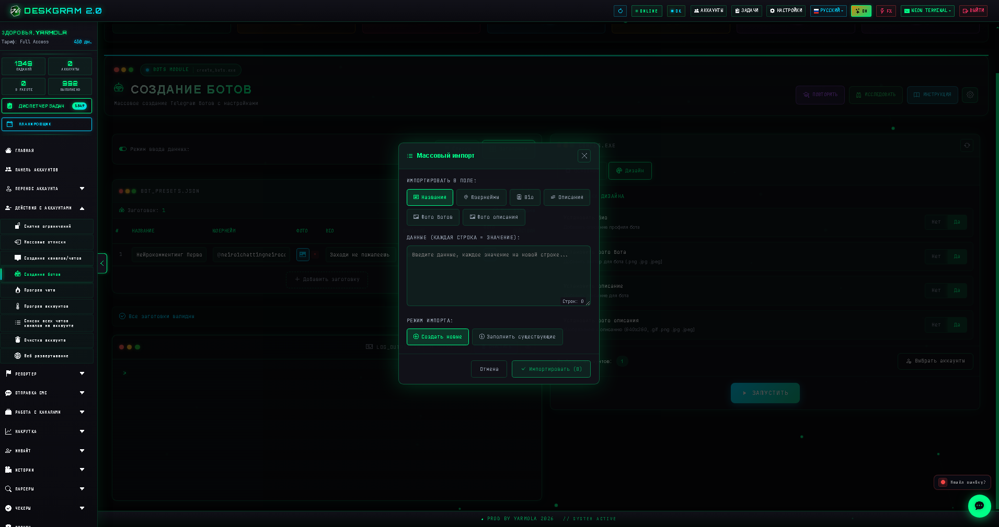

# Создание Telegram-ботов через Deskgram 2

Создание ботов в Deskgram 2 помогает массово запускать Telegram-ботов через BotFather с заранее подготовленными именами, usernames, описаниями и оформлением. Это полезно для команд, которые строят бот-сетку, тестируют гипотезы или масштабируют Telegram-инфраструктуру.

[Главный хаб Deskgram 2](https://github.com/Deskgram-2/deskgram-2-telegram-automation) · [Сайт](https://deskgram2.com/) · [Telegram-бот](https://t.me/DG2welcomebot) · [Web preview](https://deskgram2.com/web-preview?path=%2Fapp-demo%2F&lang=ru)
## Интерактивный Web Preview

Попробовать модуль в браузере: [Открыть веб-превью](https://deskgram2.com/web-preview?path=%2Fapp-demo%2Ffunctions%2Fcreate_bots&lang=ru)

## Скриншоты

## Кратко о модуле

| Параметр | Что внутри |
|---|---|
| Основная задача | Массовое создание Telegram-ботов через BotFather |
| Важные блоки | Режим списков и пресетов, performance-настройки, дизайн, usernames, логи |
| Полезен для | Запуска бот-сетки, масштабирования инфраструктуры, тестов и развертывания |
| Связанные модули | Панель аккаунтов, Настройки, Создание каналов |

## Что умеет модуль

- создавать ботов через @BotFather;
- работать по спискам имен и usernames;
- настраивать описания, био и фото бота;
- контролировать скорость и поток выполнения;
- сохранять результаты и вести логи создания.

## Быстрый старт

1. Подготовьте имена, usernames и при необходимости описания.
2. Выберите режим списков или пресетов.
3. Настройте производительность и ограничения.
4. Добавьте оформление и дополнительные параметры.
5. Запустите задачу и контролируйте результаты по логам.

## Что логично связать с этим модулем

- [Создание каналов и групп](https://github.com/Deskgram-2/telegram-channel-creator-deskgram), если боты создаются как часть более широкой сетки площадок;
- [Панель аккаунтов](https://github.com/Deskgram-2/telegram-account-manager-deskgram), если создание ботов распределяется между разными рабочими аккаунтами;
- [Настройки](https://github.com/Deskgram-2/telegram-automation-settings-deskgram), если важно заранее выровнять системные параметры и общую инфраструктуру;
- [Управление прокси](https://github.com/Deskgram-2/telegram-proxy-manager-deskgram), если окружение должно быть устойчивым на масштабе;
- [Диспетчер задач](https://github.com/Deskgram-2/telegram-task-manager-deskgram), если вы контролируете массовое создание и ошибки как единый операционный поток.

## Как устроен сценарий

### Подготовка данных

На первом этапе формируется база имен, usernames и дополнительных параметров. Это позволяет запускать создание ботов пакетно без ручной рутины.

### Управление производительностью

Параметры потоков, пауз и других ограничений помогают гибко настроить нагрузку на аккаунты и сам процесс создания.

### Доформатирование результата

После создания бот может быть дополнительно оформлен: описание, био, аватар и другие элементы доводят его до более готового состояния.

## Когда особенно полезен

- когда нужно быстро создать серию Telegram-ботов;
- когда важна стандартизация имен и описаний;
- когда вы тестируете много гипотез или инфраструктурных связок;
- когда ручное создание через BotFather становится узким местом.

## Почему это сильнее ручного создания

| Ручной подход | Создание ботов в Deskgram 2 |
|---|---|
| Слишком медленно на масштабе | Работает пакетно |
| Легко ошибиться в usernames и данных | Параметры готовятся централизованно |
| Нет единого потока управления | Есть логи, структура и контроль |
| Тяжело повторять сериями | Один сценарий работает на серию запусков |

## Смежные репозитории

- [Главный хаб Deskgram 2](https://github.com/Deskgram-2/deskgram-2-telegram-automation)
- [Панель аккаунтов](https://github.com/Deskgram-2/telegram-account-manager-deskgram)
- [Настройки](https://github.com/Deskgram-2/telegram-automation-settings-deskgram)
- [Создание каналов и групп](https://github.com/Deskgram-2/telegram-channel-creator-deskgram)
- [Управление прокси](https://github.com/Deskgram-2/telegram-proxy-manager-deskgram)
- [Диспетчер задач](https://github.com/Deskgram-2/telegram-task-manager-deskgram)

## FAQ

### Этот модуль подходит для серийного создания ботов?

Да, именно в этом его основная практическая ценность.

### Можно ли сразу задавать оформление?

Да. Имена, usernames, описание и визуальные элементы можно готовить заранее.

